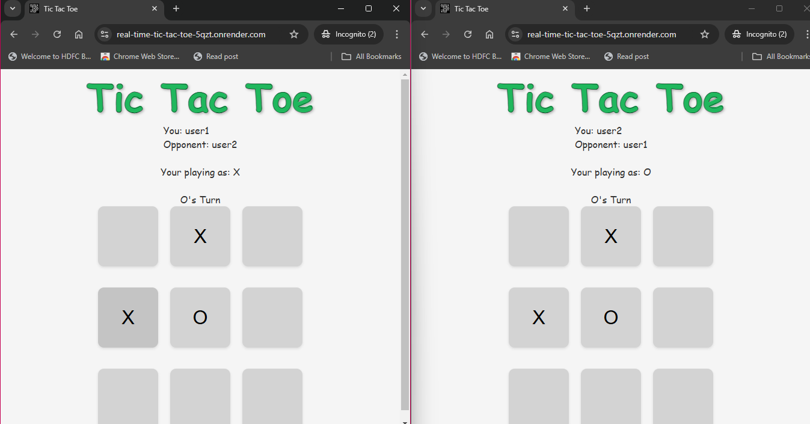

# Real-Time Multiplayer Tic Tac Toe 🎮

## Preview



**[Live Demo](https://real-time-tic-tac-toe-5qzt.onrender.com/) | [Source Code](https://github.com/Tharun-Balaji/Full-Stack/tree/main/Full_Stack_project/TIC-TAC-TOE)**

## Overview

This is a real-time multiplayer Tic Tac Toe game built using:
- HTML5
- JavaScript
- Node.js
- Express.js
- Socket.IO

The application allows two players to play Tic Tac Toe together in real-time, with instant move synchronization and turn-based gameplay.

## Key Features

- Real-time player matching
- Live game state synchronization
- Turn-based gameplay
- Automatic win/draw detection
- Responsive design

## Project Structure

```
tic-tac-toe/
│
├── index.html        # Frontend HTML structure
├── script.js         # Client-side game logic
├── server.js         # Backend server and Socket.IO handling
└── styles.css        # Game styling
```

## Socket.IO Communication Flow

### Connecting Players

When a player wants to join a game:
1. Player enters their name
2. Clicks "Search for a Player"
3. Server matches two waiting players

```javascript
// Server-side player matching
socket.on("find", (e) => {
  if (e.name != null) {
    arr.push(e.name)

    if (arr.length >= 2) {
      // Create game session for two players
      let p1obj = {
        p1name: arr[0],
        p1value: "X",
        p1move: ""
      }
      let p2obj = {
        p2name: arr[1],
        p2value: "O",
        p2move: ""
      }

      let obj = {
        p1: p1obj,
        p2: p2obj,
        sum: 1
      }

      playingArray.push(obj)
      arr.splice(0, 2)

      // Broadcast game session to all clients
      io.emit("find", { allPlayers: playingArray })
    }
  }
})
```

### Making Moves

When a player makes a move:
1. Client sends move details via Socket.IO
2. Server updates game state
3. Server broadcasts updated state to all clients

```javascript
// Client-side move submission
socket.emit("playing", { 
  value: value, 
  id: e.id, 
  name: name 
});

// Server-side move processing
socket.on("playing", (e) => {
  if (e.value == "X") {
    let objToChange = playingArray.find(
      obj => obj.p1.p1name === e.name
    )
    objToChange.p1.p1move = e.id
    objToChange.sum++
  }
  // Broadcast updated game state
  io.emit("playing", { allPlayers: playingArray })
})
```

## DOM Manipulation Techniques

### Initial State Management

Hide game elements before player joins:

```javascript
document.getElementById("loading").style.display = "none"
document.getElementById("bigcont").style.display = "none"
document.getElementById("userCont").style.display = "none"
```

### Dynamic UI Updates

Update game board and turn indicators:

```javascript
// Update board after receiving move
socket.on("playing", (e) => {
  // Update button text and disable clicked cells
  document.getElementById(`${p1id}`).innerText = "X"
  document.getElementById(`${p1id}`).disabled = true

  // Update turn indicator
  document.getElementById("whosTurn").innerText = 
    (foundObject.sum % 2 == 0) ? "O's Turn" : "X's Turn"
})
```

## Game Logic Highlights

### Win/Draw Detection

Check for winning combinations or draw:

```javascript
function check(name, sum) {
  // Get board state
  let b1 = document.getElementById("btn1").innerText || "a"
  // ... similar for other buttons

  // Check win conditions
  if ((b1 == b2 && b2 == b3) || ...) {
    socket.emit("gameOver", { name: name });
    alert(sum % 2 == 0 ? "X WON !!" : "O WON !!")
  }
  // Check for draw
  else if (sum == 10) {
    socket.emit("gameOver", { name: name });
    alert("DRAW!!")
  }
}
```

## Getting Started

### Prerequisites
- Node.js
- npm (Node Package Manager)

### Installation

1. Clone the repository
   ```bash
   git clone https://github.com/Tharun-Balaji/Full-Stack.git
   ```
2. Navigate to the project directory
   ```bash
   cd Full-Stack/Full_Stack_project/TIC-TAC-TOE
   ```
3. Install dependencies:
   ```bash
   npm install express socket.io
   ```
4. Start the server:
   ```bash
   node server.js
   ```
5. Open `http://localhost:3000` in two browser windows

## Project Links

- **Live Demo**: [https://real-time-tic-tac-toe-5qzt.onrender.com/](https://real-time-tic-tac-toe-5qzt.onrender.com/)
- **Source Code**: [GitHub Repository](https://github.com/Tharun-Balaji/Full-Stack/tree/main/Full_Stack_project/TIC-TAC-TOE)

## Future Improvements
- Add player ranking system
- Implement chat functionality
- Create more robust error handling
- Add game replay feature

## Technologies Used
- Frontend: HTML5, Vanilla JavaScript
- Backend: Node.js, Express.js
- Real-time Communication: Socket.IO

## License
MIT License

